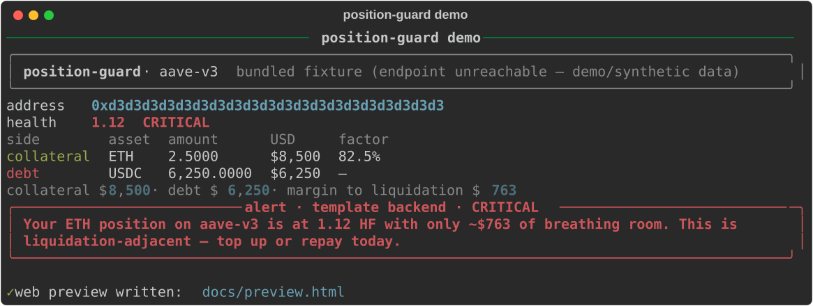

<div align="center">

# 🛡️ position-guard

Your DeFi **health monitor** — tracks Aave v3 / Compound v3 positions, computes health factors, and alerts you in plain English before liquidators do.

[](https://github.com/pxlcrtiv/position-guard/actions)
[](https://www.python.org/)
[](LICENSE)
[](https://thegraph.com/)
[](https://aave.com/)
[](https://compound.finance/)
[](https://www.coingecko.com/)
[](https://core.telegram.org/bots)
[](CONTRIBUTING.md)
[](https://github.com/pxlcrtiv/position-guard/stargazers)
[](https://github.com/pxlcrtiv/position-guard/forks)
[](https://github.com/pxlcrtiv/position-guard/commits/main)
[](https://github.com/pxlcrtiv/position-guard)

</div>

DeFi positions don't blow up slowly — they cross **health factor (HF) 1.0** and
liquidators take your collateral before you've opened the dashboard tab. HF
is the number that matters, and most tools make you hunt for it.

**position-guard watches it for you.** It reads your Aave v3 / Compound v3
positions from The Graph's public subgraphs (free, no API key), computes the
health factor, tracks it against thresholds, and writes a plain-English alert
when it matters — **LLM-written when you configure one, deterministic
templates by default**:

> "Your ETH position on aave-v3 is at 1.12 HF with only ~$763 of breathing room. This is liquidation-adjacent — top up or repay today."

Alerts land in the terminal, in a self-contained web preview page, and
optionally on **Telegram** (one env var). No keys, no accounts, no paid APIs
to get started — the demo runs fully offline on bundled fixtures.

> ⚠️ **Not financial advice; not a liquidation service.** Health factors here
> are simplified approximations of protocol math. Always confirm against the
> protocol UI before acting. This tool never touches your funds — it only reads
> public data and tells you what it sees.

---

## What it does

- 📡 **Subgraph client** for Aave v3 and Compound v3 (The Graph hosted
  service, free tier, no key) — with an automatic fallback to bundled
  GraphQL fixture responses when the endpoint is unreachable.
- 🧮 **Health-factor math** for both protocols, tested against hand-computed
  golden fixtures (Aave v3 uses per-asset liquidation thresholds; Compound v3
  uses borrow collateralization percents). Also computes **margin to
  liquidation** ($) and a per-asset **liquidation price**.
- 🚦 **Threshold state machine**: `healthy → watch → warning → critical →
  liquidation`, alerting on *downgrades* (and optionally recoveries), with
  per-level dedupe so a stuck position nags once, not every poll.
- 🧠 **Alert writer**, two interchangeable backends:
  - `template` — deterministic, offline, zero-dependency (default)
  - `llm` — any OpenAI-compatible endpoint; **degrades gracefully** to
    templates on any failure so alerts are never silently dropped
- 🗄️ **SQLite history** (stdlib `sqlite3`) — every snapshot and alert is
  stored; `history` replays what happened and when.
- 📄 **Web preview** — a standalone dark-themed HTML page (no JS, no network)
  rendering the position, the HF bar, and the alert. The keyless demo.
- 📱 **Telegram** (optional) — state-change alerts via the Bot API; a plain
  HTTPS post, so no extra dependencies.
- 🔁 **Scheduler loop** — `watch` polls on an interval and alerts on change;
  Ctrl-C clean, `--once` for cron.

## Tech stack

| Layer | Choice |
|---|---|
| Language | Python ≥ 3.10 (`click` CLI, dataclasses, `httpx`), ruff-linted |
| Data | The Graph hosted subgraphs (Aave v3 `aave/protocol-v3`, Compound v3 `mason/compound-v3`) with bundled fixture fallback |
| Prices | CoinGecko free `/simple/price`, TTL cache, bundled fallback |
| Alerts | Template backend (default) + optional OpenAI-compatible LLM backend, graceful degradation |
| Storage | SQLite (stdlib `sqlite3`), snapshots + deduped alert history |
| Notifications | Telegram Bot API (optional, one env var), rich terminal, standalone HTML preview |
| CI | GitHub Actions — pytest ×2 Python versions + ruff + demo smoke |

## Demo (zero keys, offline, ~3 s)

```bash
pip install -e .            # or: pip install -r requirements.txt
position-guard demo         # Aave v3 fixture; --protocol compound-v3 for the other
```



Real output from `position-guard demo` (bundled synthetic fixture — the same
data path tests use):

```
───────────────────────────── position-guard demo ──────────────────────────────
╭──────────────────────────────────────────────────────────────────────────────╮
│ position-guard · aave-v3             bundled fixture (endpoint unreachable — │
│                                                         demo/synthetic data) │
╰──────────────────────────────────────────────────────────────────────────────╯
address   0xd3d3d3d3d3d3d3d3d3d3d3d3d3d3d3d3d3d3d3d3
health    1.12  CRITICAL
side        asset      amount     USD  factor
collateral    ETH      2.5000  $8,500   82.5%
debt         USDC  6,250.0000  $6,250       —
collateral $8,500 · debt $6,250 · margin to liquidation $763
╭──────────────────── alert · template backend · CRITICAL ─────────────────────╮
│ Your ETH position on aave-v3 is at 1.12 HF with only ~$763 of breathing      │
│ room. This is liquidation-adjacent — top up or repay today.                  │
╰──────────────────────────────────────────────────────────────────────────────╯

✓ web preview written: docs/preview.html
```

It also writes **`docs/preview.html`** — a standalone page (dark theme, HF
bar, per-leg table, the alert) you can open in any browser or host anywhere.
Open it with `position-guard demo --serve` to serve the folder on
`http://127.0.0.1:8000`.

## Quickstart

```bash
# 1. install (Python ≥ 3.10)
git clone https://github.com/pxlcrtiv/position-guard.git
cd position-guard
python -m venv .venv && source .venv/bin/activate
pip install -e .            # console script: position-guard

# 2. keyless demo (2 commands, ~3 s, fully offline)
position-guard demo
position-guard demo --protocol compound-v3

# 3. check a real address (falls back to labeled fixture data offline)
position-guard check --address 0xYourAddressHere --protocol aave-v3

# 4. watch it (poll every 60 s, alert on state changes, deduped)
position-guard watch --address 0xYourAddressHere --interval 60

# 5. replay stored alerts
position-guard history

# JSON for your own tooling
position-guard check --address 0xYourAddressHere --json-out
```

### Live data & the graph

`check` / `watch` query the public subgraphs by default. When the endpoint is
unreachable (offline, rate-limited, sunsetted hosted service) the client
**falls back to the bundled fixture** and labels the output
`bundled fixture (demo/synthetic data)` — you always know what you're looking
at. Force fixtures with `--offline`.

> The Graph's legacy hosted service has been going through a sunset; when it
> is down, live mode simply degrades to fixtures (which is exactly why they
> ship). Swap in any compatible endpoint — the client just needs a GraphQL
> `user`/`account` JSON shape.

### State severity

| HF range | Level | Alert |
|---|---|---|
| ≤ 1.00 | 🔴 liquidation | liquidators can take collateral right now |
| 1.00 – 1.15 | 🟠 critical | top up / repay today |
| 1.15 – 1.30 | 🟡 warning | plan the top-up |
| 1.30 – 1.50 | watch | monitor |
| \> 1.50 | 🟢 healthy | nothing to do |

Thresholds are constants in `position_guard/state.py` (`Thresholds`) — feed
your own via `classify(hf, Thresholds(...))`.

### Telegram (optional)

```bash
export TELEGRAM_BOT_TOKEN="123456:ABC-..."        # from @BotFather
export TELEGRAM_CHAT_ID="123456789"               # optional; defaults to getMe
position-guard watch --address 0xYourAddressHere --interval 300 --telegram
```

No token → no Telegram, and the tool tells you so. That's it.

### LLM-written alerts (optional)

```bash
export POSITION_GUARD_ALERT_BACKEND=llm
export POSITION_GUARD_LLM_API_KEY="sk-..."        # OpenAI-compatible key
export POSITION_GUARD_LLM_BASE_URL="https://api.openai.com/v1"   # default; any OpenAI-compatible works
export POSITION_GUARD_LLM_MODEL="gpt-4o-mini"     # default
position-guard check --address 0xYourAddressHere
```

Every failure (no key, timeout, non-2xx, malformed response) falls back to
the deterministic templates — alerts are never dropped.

## Health factor math (the honest version)

- **Aave v3:** `HF = Σ(collateral_usd_i × liquidation_threshold_i) / Σ(debt_usd)`,
  where each asset's threshold comes from the reserve (e.g. 82.5% ETH mainnet:
  0.825). Thresholds are *per asset*, and interest accrual between snapshots
  isn't modelled — real HF moves every block.
- **Compound v3:** `HF = Σ(collateral_usd_i × borrow_collateralization_pct_i) / base_borrow_usd`.
  The Comet subgraph doesn't expose per-account borrow collateralization, so
  position-guard ships the documented USDC-Comet config as data
  (`CompoundV3Client._borrow_col_pct`) — review it against the live comet
  config before trusting live numbers.
- **Margin to liquidation:** the dollar distance to HF = 1.0 (weighted
  collateral − debt). "~$763 of breathing room" = a $763 price move against
  all legs from this snapshot.
- **Liquidation price:** per collateral asset, the price at which HF crosses
  1.0 holding everything else fixed.

The math is a monitoring aid. Protocol UI numbers win when they differ.

## Daily Green automation

This repo makes one meaningful, dated commit every single day — no empty
commits and no filler: each day appends one hand-curated DeFi liquidity-risk
tip to `docs/daily-tips.md`, rotated deterministically from a pool.

- `scripts/daily_update.py` picks today's tip from `scripts/tips_pool.json`
  (calendar-day rotation), appends it to `docs/daily-tips.md`, commits it as
  `docs: daily defi risk tip YYYY-MM-DD` and pushes.
- Idempotent: a day is never committed twice; repeated runs are no-ops.
- Local scheduler (primary): macOS `launchd` at **12:07 and 18:07 local**
  (`~/Library/LaunchAgents/com.pxlcrtiv.daily-green.plist`, wrapper
  `~/portfolio/scripts/daily-green.sh` — auto-discovers every portfolio repo,
  including this one).
- Cloud fallback: `.github/workflows/daily.yml` runs the same script at
  **12:00 UTC**. Whichever fires first wins the day; missed days are backfilled
  (max 14) with dated, non-empty commits.
- Pause: `touch .daily-pause` (this repo) or unload the launchd job (all).

> Note: this GitHub account currently cannot start Actions runners at all
> (account billing lock). The workflow files are valid and take over once
> that is resolved; until then the local launchd job is the live scheduler.

## Roadmap / status

| Item | Status |
|---|---|
| Subgraph client + fixture fallback | ✅ |
| Health-factor math (golden-tested) + margin + liq price | ✅ |
| Thresholds + state machine + deduped alerts | ✅ |
| Alert writer (template + LLM fallback) | ✅ |
| Telegram send path (optional) | ✅ |
| SQLite history + CLI (`check`/`watch`/`demo`/`preview`/`history`) | ✅ |
| Web preview (keyless demo) + README transcript | ✅ |
| Tests (52, offline) + CI + Daily Green | ✅ |
| 🔜 More protocols (Spark, Morpho), multi-address watch, alert webhooks | planned |

## Related

- [slither-chat](https://github.com/pxlcrtiv/slither-chat) — smart-contract audit copilot (same alert-writer degradation pattern)
- [model-ledger](https://github.com/pxlcrtiv/model-ledger) — on-chain provenance for ML models
- [agent-lab](https://github.com/pxlcrtiv/agent-lab) — zero-dependency AI agent framework
- [Aave v3 docs](https://docs.aave.com/risk/liquidation) · [Compound v3 docs](https://docs.compound.finance/) — the math this models

## License

MIT — see [LICENSE](LICENSE).